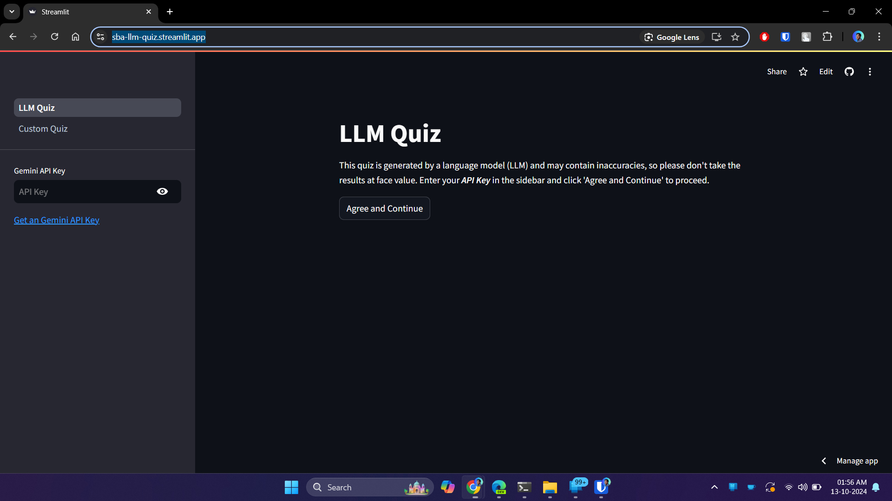
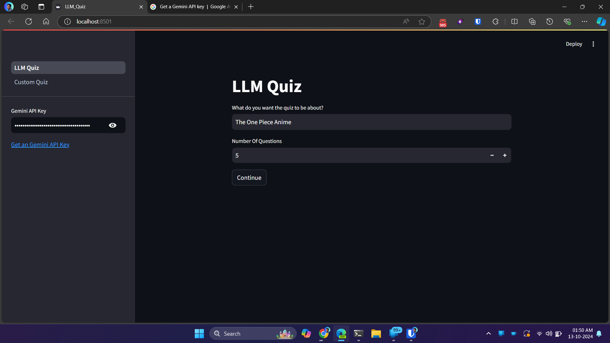
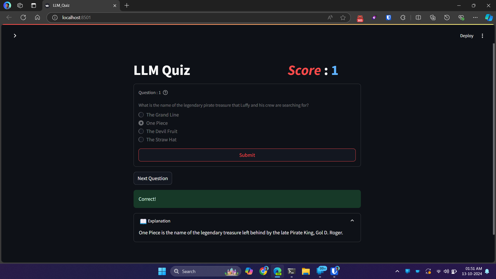
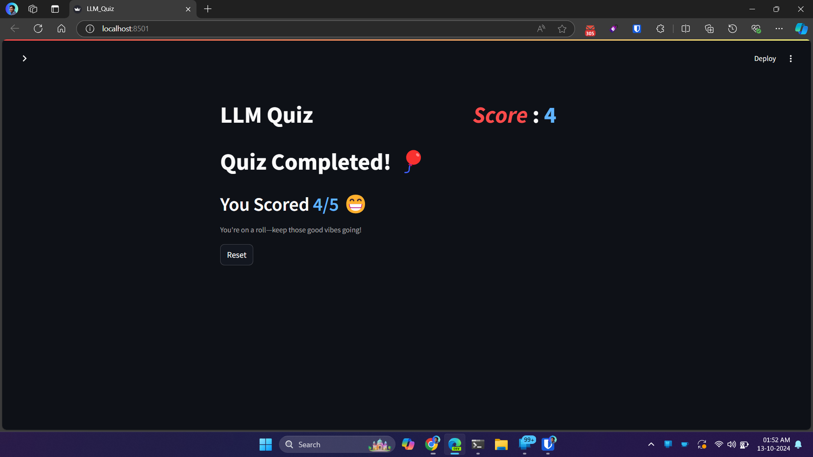

# 🧠 LLM Quiz Generator

A Python WebApp that uses Streamlit for the frontend and Gemini LLM for generating dynamic quizzes. Get a quiz on any topic you want, or load your own CSV for custom quizzes.

🚀 **Check out a Demo Here:** https://sba-llm-quiz.streamlit.app/

## 📸 Screenshots

<table>
  <tr>
    <th>HOME Page</th>
    <th>Quiz Configuration Page</th>
  </tr>
  <tr>
    <td></td> 
    <td></td>
  </tr>
  <tr>
    <th>Quiz Page</th>
    <th>Results Page</th>
  </tr>
    <tr>
    <td></td> 
    <td></td>
  </tr>
</table>

> 🔍 Click images to see in better resolution

## 🚀 Features

- 🤖 Dynamic quiz generation using Gemini LLM
- 🎨 User-friendly Streamlit interface
- 📈 Instant quiz results and explanations
- 🔄 Option to retake quizzes or try new topics
- 📊 Support for custom quizzes via CSV

## 🛠️ Usage

### 🤖 LLM QUIZ

1. Enter your Gemini API key in the sidebar (Get it [here](https://ai.google.dev/gemini-api/docs/api-key))
2. Choose "LLM Quiz" from the navigation menu
3. Enter the desired quiz topic and number of questions
4. Click "Generate Quiz" to start

<details>
  <summary>📊 Custom Quiz (CSV) without LLM</summary>

### 📊 Custom Quiz (CSV) without LLM

- 3 AWS Quizzes have been preloaded; you can add your own as well
- Place the CSV file in the `output` folder
- The CSV should be in the following format:
  - `"question","option_a","option_b","option_c","option_d","answer","explanation"`
- Comma-separated and enclosed in quotes
- Alternatively, you can use `generate_questions_from_file.py` to generate the CSV based on question and answer dumps placed in the `input_questions` folder (e.g., `Input_Questions/DynamoDB.txt`)
  - This uses LLM to generate fake options for the invalid answers
  </details>

## 🏁 Getting Started

These instructions will get you a copy of the project up and running on your local machine for development and testing purposes.

### 📋 Prerequisites

Things you need to run the code:

- Python 3.7+
- pip (Python package manager)

### 🔧 Installing

1. Clone the repository:

   ```
   git clone https://github.com/your-username/llm-quiz-generator.git
   cd llm-quiz-generator
   ```

2. Install required packages:
   ```
   pip install -r requirements.txt
   ```

### 🏃‍♂️ Running The App

1. Start the Streamlit app:

   ```
   streamlit run LLM_Quiz.py
   ```

2. Open your browser and go to http://localhost:8501

## 🛠️ Built With

- [Python 3](https://www.python.org/) - The Programming Language used
- [Streamlit](https://streamlit.io/) - Streamlit is an open-source Python framework for data-based frontend
- [Gemini](https://ai.google.dev/gemini-api/docs) - Gemini is the LLM used to generate Q&A for the Quiz

## 🤝 Contributing

Contributions are welcome! Please feel free to submit a Pull Request.

## 📃 License

This project is licensed under the MIT License - see the [LICENSE](LICENSE) file for details

---

> 🌟 Feel free to star this repository if you like what you see 😉.
